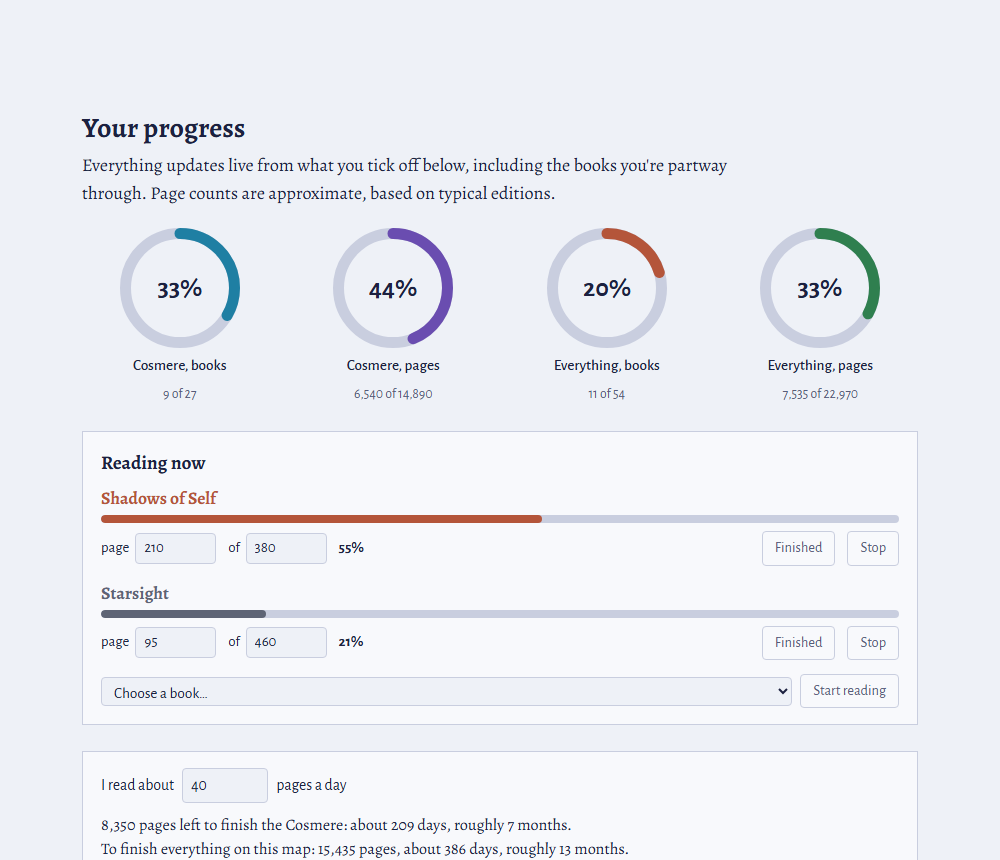
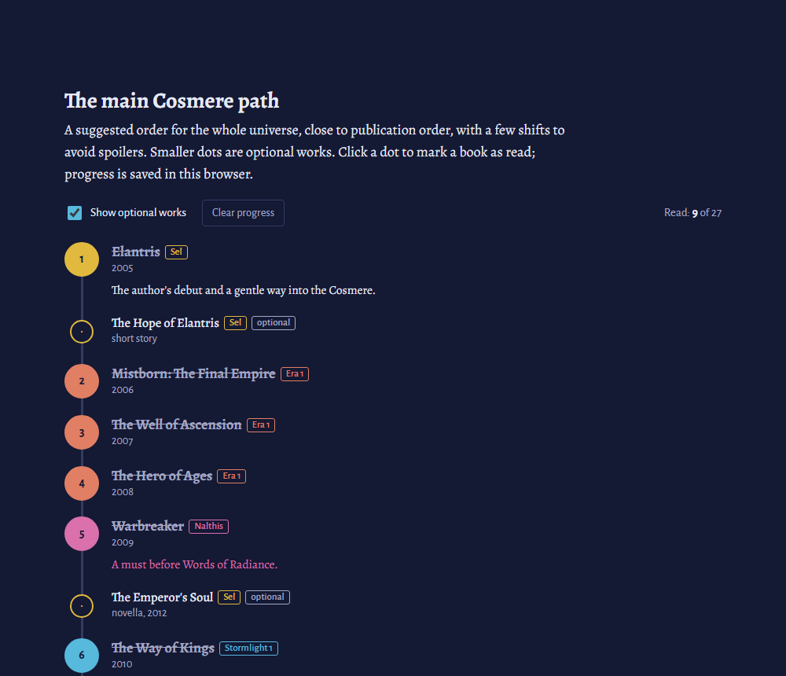
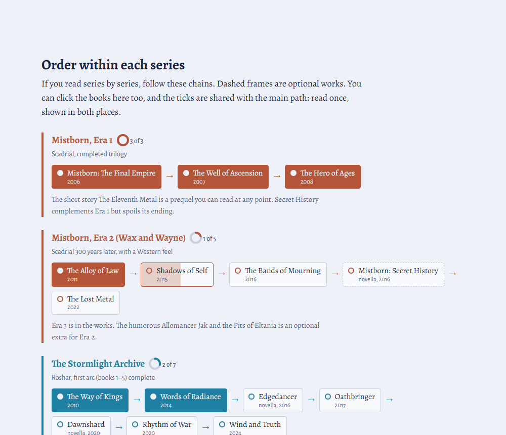
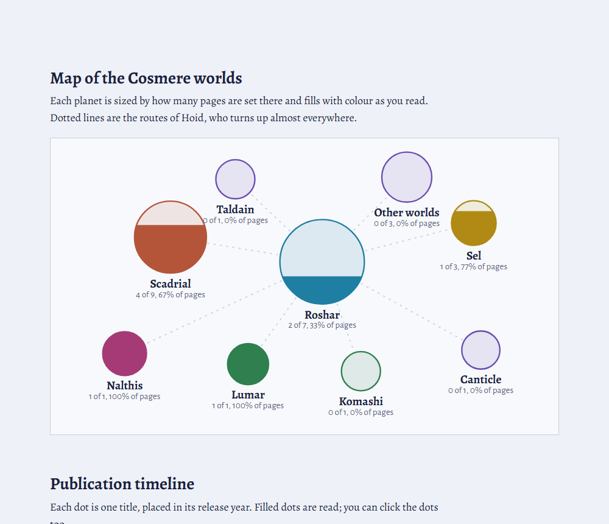
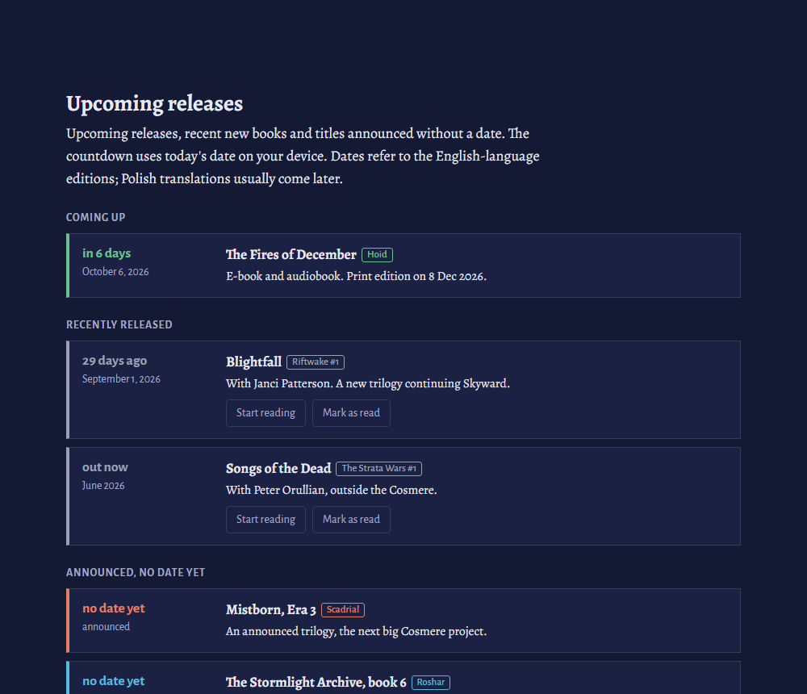
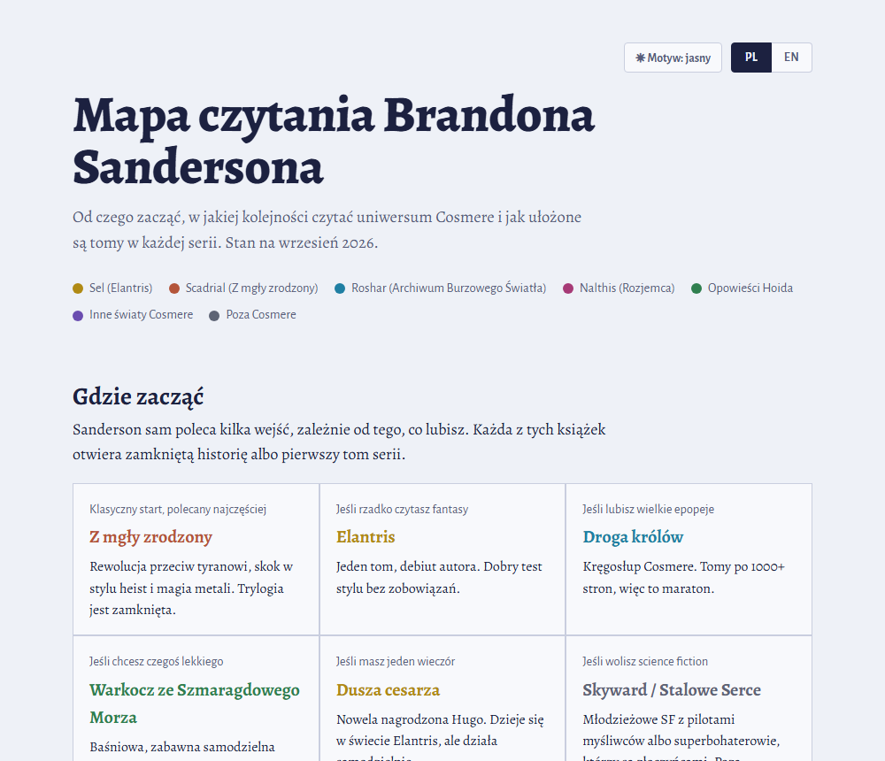

# Brandon Sanderson Reading Map · Mapa czytania Sandersona

**[English](#english) · [Polski](#polski)**

**Live page / Strona:** [https://YOUR-USERNAME.github.io/sanderson-mapa/](https://stargate3.github.io/sanderson-mapa/)

> **Unofficial fan project.** Not affiliated with, endorsed by or connected to Brandon Sanderson or Dragonsteel Entertainment. Book titles, world names and series names belong to their respective owners. The page contains no book text, covers or artwork.
>
> **Nieoficjalny projekt fanowski.** Nie jest powiązany z Brandonem Sandersonem ani z Dragonsteel Entertainment, nie jest też przez nich wspierany. Tytuły książek, nazwy światów i serii należą do ich właścicieli. Strona nie zawiera tekstu książek, okładek ani grafik.

---

## English

An interactive reading guide and tracker for Brandon Sanderson's books: where to start, what order to read the Cosmere in, and how far you've got. It's a single HTML file that runs entirely in your browser, with no account, no sign-up and no tracking.

### Features

- **Where to start:** six entry points depending on what you like (classic fantasy, epic, something light, sci-fi…).
- **Main Cosmere path:** a suggested reading order for the whole Cosmere, close to publication order with a few spoiler-safe shifts. Optional works can be hidden.
- **Series chains:** the order inside every series, Cosmere and non-Cosmere (Mistborn, Stormlight, Skyward, The Reckoners, Legion, Alcatraz and more). Ticks are shared with the main path.
- **Spoiler warnings:** if you mark a book whose prerequisites you haven't read (e.g. *Words of Radiance* before *Warbreaker*), the page tells you.
- **Reading now:** track the page you're on, with your own edition's page count. Partial progress counts towards all the stats.
- **Progress stats:** rings for books and pages, for the Cosmere and for everything.
- **Reading and listening pace:** enter pages per day, or audiobook hours per day and playback speed, and see how long the rest will take. Audiobook lengths are real running times from Audioteka and Storytel where available, and estimated from page counts otherwise.
- **What next?:** suggestions for the next book on the path and in the series you've started.
- **Upcoming releases:** countdown to new books, recent releases and announced titles without a date.
- **Map of the Cosmere worlds:** each planet is sized by page count and fills with colour as you read.
- **Publication timeline:** every book in its release year.
- **English and Polish:** switch with the PL / EN buttons, or link straight to a language with `?lang=en` or `?lang=pl`.
- **Light and dark theme:** follows your system by default, or pick one.
- **Move progress between devices:** copy a short code on one device and paste it on another.

### Screenshots

| Main path (dark theme) | Series order |
|---|---|
|  |  |
| **Cosmere map** | **Upcoming releases** |
|  |  |

### Your data

Progress is saved only in your own browser (`localStorage`). Nothing is sent anywhere, and nobody else can see what you've read. Clearing your browser data also clears your progress, so use the progress code to back it up or move it. The only external request is for the fonts (Google Fonts).

### Sources and accuracy

- Page counts are approximate, based on typical English-language editions.
- Audiobook running times come from Audioteka and Storytel (Polish recordings, plus English ones where no Polish version exists), checked on 30 September 2026. Dramatized adaptations (GraphicAudio) are not used.
- Release dates are for English-language editions. New books come out often, so check the author's website for the latest news.

Spotted a wrong date, a missing book or a translation issue? Open an issue.

### Running it locally

Download `index.html` and open it in any modern browser. That's it.

---

## Polski

Interaktywny przewodnik i tracker czytania książek Brandona Sandersona: od czego zacząć, w jakiej kolejności czytać Cosmere i ile już za Tobą. To jeden plik HTML, który działa w całości w przeglądarce, bez konta, rejestracji i śledzenia.

### Funkcje

- **Gdzie zacząć:** sześć punktów wejścia zależnie od tego, co lubisz (klasyczne fantasy, epopeja, coś lekkiego, SF…).
- **Główna ścieżka Cosmere:** proponowana kolejność całego uniwersum, zbliżona do kolejności wydań, z kilkoma przesunięciami chroniącymi przed spoilerami. Utwory opcjonalne można ukryć.
- **Kolejność w seriach:** łańcuchy dla każdej serii, w Cosmere i poza nim (Z mgły zrodzony, Archiwum Burzowego Światła, Skyward, Mściciele, Legion, Alcatraz i inne). Zaznaczenia łączą się z główną ścieżką.
- **Ostrzeżenia o spoilerach:** gdy oznaczysz książkę bez przeczytania wcześniejszych (np. *Słowa światłości* przed *Rozjemcą*), strona o tym powie.
- **Czytam teraz:** zapisujesz stronę, na której jesteś, z liczbą stron swojego wydania. Częściowy postęp wlicza się do wszystkich statystyk.
- **Statystyki postępu:** pierścienie dla książek i stron, osobno dla Cosmere i dla całości.
- **Tempo czytania i słuchania:** podajesz liczbę stron dziennie albo godziny audiobooka dziennie i prędkość odtwarzania, a strona liczy, ile to jeszcze potrwa. Długość audiobooków to rzeczywiste czasy z Audioteki i Storytela, a tam, gdzie ich nie ma, szacunek z liczby stron.
- **Co dalej?:** podpowiedzi następnej książki na ścieżce i w rozpoczętych seriach.
- **Zapowiedzi i premiery:** odliczanie do nowych książek, niedawne premiery i zapowiedzi bez daty.
- **Mapa światów Cosmere:** planety mają rozmiar zależny od liczby stron i wypełniają się kolorem w miarę czytania.
- **Oś czasu wydań:** każda książka w roku premiery.
- **Polski i angielski:** przełącznik PL / EN albo link od razu do wybranego języka: `?lang=pl` lub `?lang=en`.
- **Jasny i ciemny motyw:** domyślnie jak w systemie, można też wybrać ręcznie.
- **Przenoszenie postępu:** kopiujesz krótki kod na jednym urządzeniu i wklejasz na drugim.

### Twoje dane

Postęp zapisuje się tylko w Twojej przeglądarce (`localStorage`). Nic nie jest nigdzie wysyłane i nikt nie widzi, co przeczytałeś. Wyczyszczenie danych przeglądarki kasuje też postęp, więc do kopii zapasowej używaj kodu postępu. Jedyne zewnętrzne połączenie to pobranie czcionek (Google Fonts).

### Źródła i dokładność

- Liczby stron są przybliżone, według typowych wydań anglojęzycznych.
- Długość audiobooków pochodzi z Audioteki i Storytela (polskie nagrania, a angielskie tylko tam, gdzie polskich nie ma), stan na 30 września 2026. Słuchowiska (GraphicAudio) nie są brane pod uwagę.
- Daty premier dotyczą wydań anglojęzycznych. Nowe książki pojawiają się często, więc po aktualności warto zajrzeć na stronę autora.
- Polskie tytuły według wydań MAG, Zysk i Audioteki. Gdy polskiego wydania nie ma, podany jest tytuł oryginalny.

Widzisz błędną datę, brakującą książkę albo problem z tłumaczeniem? Zgłoś to w zakładce Issues.

### Uruchomienie lokalnie

Pobierz plik `index.html` i otwórz go w dowolnej nowoczesnej przeglądarce. To wszystko.
